# 新冠疫情相似句对判定大赛 线上第一名方案

pku吴彦祖队 朱政烨

## 赛题分析

### 赛题背景

面对疫情抗击，疫情知识问答应用得到普遍推广。如何通过自然语言技术将问答进行相似分类仍然是一个有价值的问题。如识别患者相似问题，有利于理解患者真正诉求，帮助快速匹配准确答案，提升患者获得感；归纳医生相似答案，有助于分析答案规范性，保证疫情期间问诊规范性，避免误诊。

### 任务目标

比赛整理近万条真实语境下疫情相关的患者提问句对，要求选手通过自然语言处理技术识别相似的患者问题。

### 数据示例

| query1                   | query2                         | label |
| ------------------------ | ------------------------------ | ----- |
| 剧烈运动后咯血,是怎么了? | 剧烈运动后咯血是什么原因？     | 1     |
| 剧烈运动后咯血,是怎么了? | 剧烈运动后为什么会咯血？       | 1     |
| 剧烈运动后咯血,是怎么了? | 剧烈运动后咯血，应该怎么处理？ | 0     |
| 剧烈运动后咯血,是怎么了? | 剧烈运动后咯血，需要就医吗？   | 0     |
| 剧烈运动后咯血,是怎么了? | 剧烈运动后咯血，是否很严重？   | 0     |

### 文本长度

训练集和验证集分布类似，大都集中在10-20个字

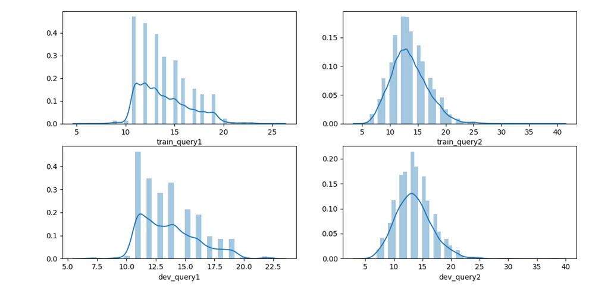

### 标签分布

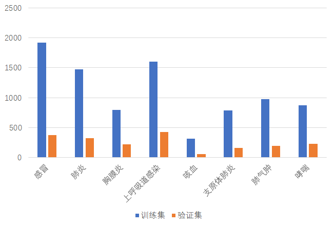

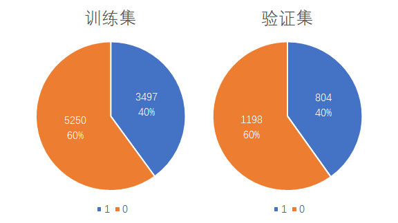


## 总体思路

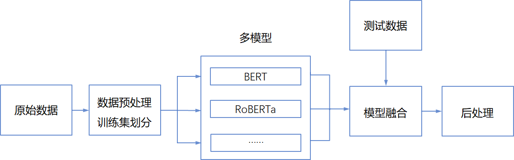

### 数据划分

采用kfold交叉验证（右边的划分方式）

•利用全部数据，获得更多信息

•降低方差，提高模型性能

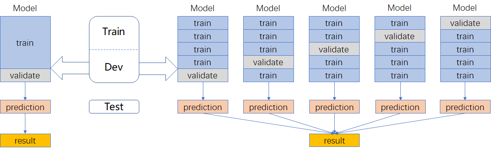

##### 模型设计

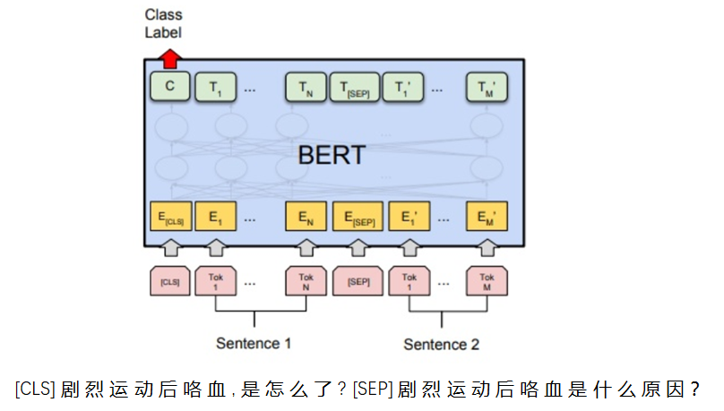

二分类交叉熵损失函数：

### 模型融合

小模型同时加入CHIP2019数据训练

| 模型               | 特点                       | 权重 | 加入外部句对数据 |
| ------------------ | -------------------------- | ---- | ---------------- |
| BERT-wwm-ext       | 全词Mask                   | 1    | YES              |
| Ernie-1.0          | 对词、实体及实体关系建模   | 1    | YES              |
| RoBERTa-large-pair | 面向相似性或句子对任务优化 | 1    | NO               |


## 技巧尝试

感想：数据量小、干净、简单，普普通通的bert就能接近性能上限，很多trick容易过拟合

### 数据预处理

对称扩充、传递扩充（注意要保持原来的分布，否则会过拟合）

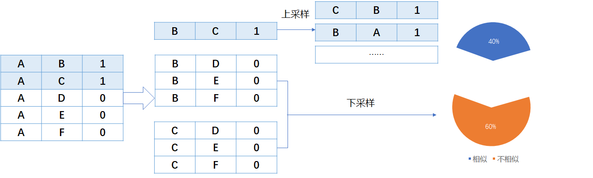


### 训练

- 三种结构：(实际使用差别不大，第一种又好又简单)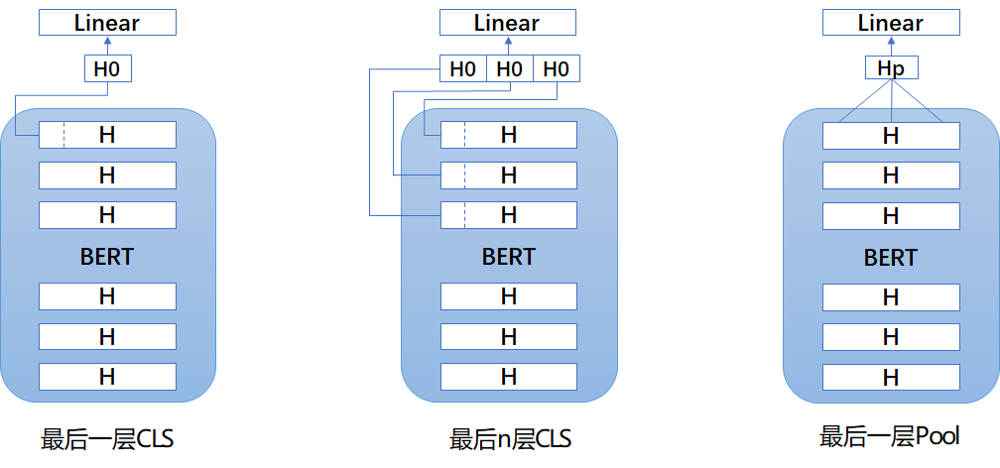
- 对抗训练


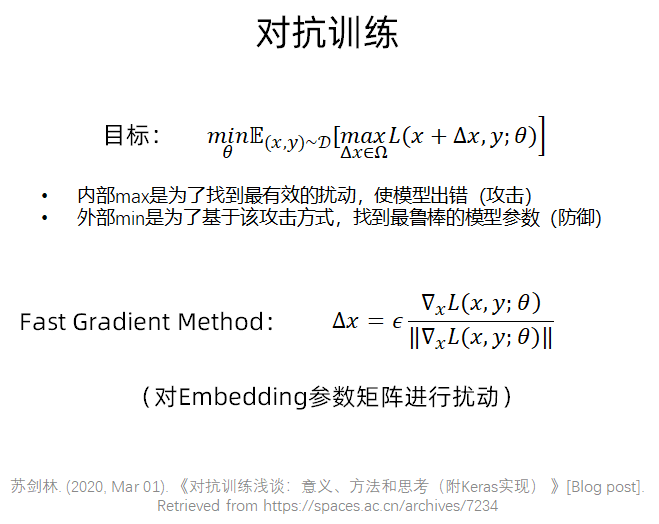

```
#代码来自苏剑林bert4keras

def adversarial_training(model, embedding_name, epsilon=1):
    """给模型添加对抗训练
    其中model是需要添加对抗训练的keras模型，embedding_name
    则是model里边Embedding层的名字。要在模型compile之后使用。
    """
    if model.train_function is None:  # 如果还没有训练函数
        model._make_train_function()  # 手动make
    old_train_function = model.train_function  # 备份旧的训练函数

    # 查找Embedding层
    for output in model.outputs:
        embedding_layer = search_layer(output, embedding_name)
        if embedding_layer is not None:
            break
    if embedding_layer is None:
        raise Exception('Embedding layer not found')

    # 求Embedding梯度
    embeddings = embedding_layer.embeddings  # Embedding矩阵
    gradients = K.gradients(model.total_loss, [embeddings])  # Embedding梯度
    gradients = K.zeros_like(embeddings) + gradients[0]  # 转为dense tensor

    # 封装为函数
    inputs = (model._feed_inputs +
              model._feed_targets +
              model._feed_sample_weights)  # 所有输入层
    embedding_gradients = K.function(
        inputs=inputs,
        outputs=[gradients],
        name='embedding_gradients',
    )  # 封装为函数

    def train_function(inputs):  # 重新定义训练函数
        grads = embedding_gradients(inputs)[0]  # Embedding梯度
        delta = epsilon * grads / (np.sqrt((grads**2).sum()) + 1e-8)  # 计算扰动
        K.set_value(embeddings, K.eval(embeddings) + delta)  # 注入扰动
        outputs = old_train_function(inputs)  # 梯度下降
        K.set_value(embeddings, K.eval(embeddings) - delta)  # 删除扰动
        return outputs

    model.train_function = train_function  # 覆盖原训练函数
    
# 写好函数后，启用对抗训练只需要一行代码
adversarial_training(model, 'Embedding-Token', 0.5)
```


### 预测

- 算数平均→几何平均→sigmoid平均（用反函数取出sigmoid/softmax归一化之前的状态做平均，信息量更大，提升明显）

  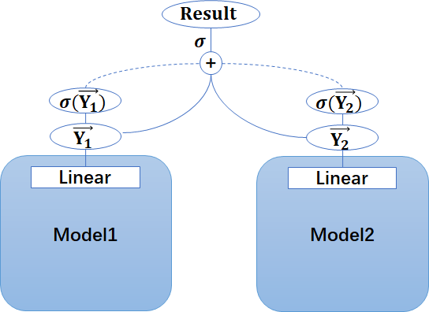

- 分类阈值微调（0.47）

- 伪标签

  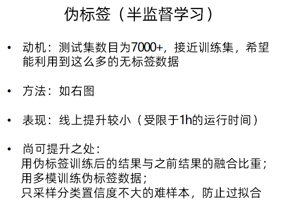

  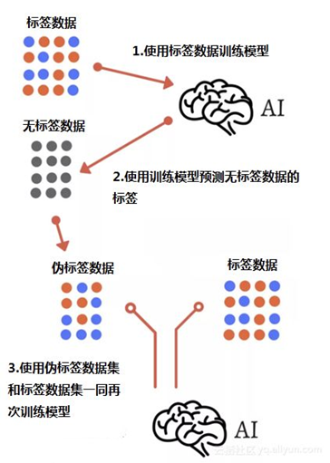

  

## 经验总结

- 此次比赛任务较为简单，数据干净，使用普通的BERT预训练模型便可达到95+的准确度量级，完全足以能够投入日常应用
- 调参和模型融合是最有效的提升手段，很多复杂的技巧反而没有效果
- 准确度和时间复杂度不可兼得，如何满足现实中毫秒级的查询需求，还需进一步探究
- 参加这种公益性质赛事，不仅能够在实践中学习自然语言处理知识，也有助于关注疫情形势，为助力疫情智能问答应用技术贡献出微薄的一点力量


